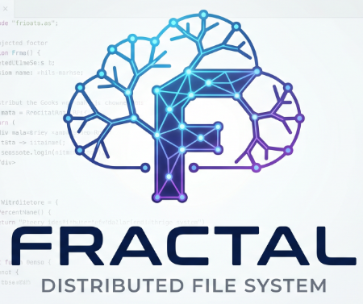

# Fractal

<div align="center">
    
</div>


## Generating Random Data

If you want to test the cluster's chunking and streaming performance before uploading your actual files, you can instantly generate massive dummy files directly from your terminal.

### 🍎🐧 For Mac / Linux Users 
Use the `dd` command to stream random data into a new file. The file will be created exactly inside the directory where your terminal is currently open:

```bash
dd if=/dev/urandom of=random-1gb.bin bs=1M count=1024 status=progress
```

- `dd`: standard Unix utility used to copy and convert data
- `if=/dev/urandom`: the Input File. This points to a special system file that outputs an endless stream of random garbage data
- `of=random-1gb.bin`: this the name of the file you are creating
- `bs=1M`: the Block Size. It tells the command to write the data in 1 Megabyte chunks. You can also use K  for Kilobyte or G for Gigabyte 
- `count=1024`: the total number of blocks to write -> 1024 blocks × 1 Megabyte = 1 Gigabyte
- `status=progress`: shows you the generation speed and progress in real-time

### 🪟 For Windows Users
Use the native `fsutil` command to instantly allocate a file of a specific size on your hard drive. The file will be created exactly inside the folder where your command prompt terminal is currently open:

```cmd
fsutil file createnew random-1gb.bin 1073741824
```

- `fsutil file createnew`: the built-in Windows utility command used to instantly allocate empty file space
- `random-1gb.bin`: the name of the output file
- `1073741824`: the exact file size required in bytes -> because 1GB = 1024 MB = 1,048,576 KB = 1,073,741,824 bytes


## Global CLI Installation

To get the most out of Fractal, you can install it as a native, globally accessible command on your system. This allows you to interact with the cluster from any folder on your computer without needing to use `go run`.

**Before:** `go run ./cmd/client create "fileName.pdf"`

**After:** `fractal create "fileName.pdf"`

---

### 🪟 For Windows Users

Open your terminal in the root of the project and run the build script:
```cmd
.\script\make
```

This compiles the Go code and safely places `fractal.exe` into a permanent `C:\Fractal` folder.

To tell Windows where to find the `fractal` command, in the 'User Environment Variables' find the variable named 'Path', select it, and add `C:\Fractal`. Click OK on all windows to save.


## Git Commit Conventions
* **feat**: adds, adjusts, or removes a new feature to the API or UI.
* **fix**: fixes an API or UI bug of a preceded feat commit.
* **refactor**: rewrites or restructures code without altering API or UI behavior.
* **perf**: a special type of refactor commit that specifically improves performance.
* **style**: Addresses code style (e.g., white-space, formatting, missing semi-colons) and does not affect application behavior.
* **test**: adds missing tests or corrects existing ones.
* **docs**: exclusively affects documentation (like this README).
* **build**: affects build-related components such as build tools, dependencies, or project version.
* **ops**: affects operational aspects like infrastructure (IaC), deployment scripts, CI/CD pipelines, backups, monitoring, or recovery procedures.
* **chore**: represents routine tasks like initial commits, modifying .gitignore, etc.