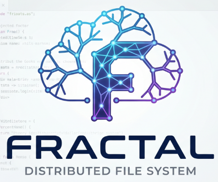

# Fractal

<div align="center">
    
</div>


<br> </br>
## Generating Random Data

If you want to test the cluster's chunking and streaming performance before uploading your actual files, you can instantly generate massive dummy files directly from your terminal.

### 🍎🐧 For Mac / Linux Users 
Use the `dd` command to stream random data into a new file. The file will be created exactly inside the directory where your terminal is currently open:

```bash
dd if=/dev/urandom of=random-1gb.bin bs=1M count=1024 status=progress
```

- `dd`: standard Unix utility used to copy and convert data
- `if=/dev/urandom`: the Input File. This points to a special system file that outputs an endless stream of random garbage data
- `of=random-1gb.bin`: this the name of the file you are creating
- `bs=1M`: the Block Size. It tells the command to write the data in 1 Megabyte chunks. You can also use K  for Kilobyte or G for Gigabyte 
- `count=1024`: the total number of blocks to write -> 1024 blocks × 1 Megabyte = 1 Gigabyte
- `status=progress`: shows you the generation speed and progress in real-time

### 🪟 For Windows Users
Use the native `fsutil` command to instantly allocate a file of a specific size on your hard drive. The file will be created exactly inside the folder where your command prompt terminal is currently open:

```cmd
fsutil file createnew random-1gb.bin 1073741824
```

- `fsutil file createnew`: the built-in Windows utility command used to instantly allocate empty file space
- `random-1gb.bin`: the name of the output file
- `1073741824`: the exact file size required in bytes -> because 1GB = 1024 MB = 1,048,576 KB = 1,073,741,824 bytes


<br> </br>
## Global CLI Installation

To get the most out of Fractal, you can install it as a native, globally accessible command on your system. This allows you to interact with the cluster from any folder on your computer without needing to use `go run`.

**Before:** `go run ./cmd/client create "fileName.pdf"`

**After:** `fractal create "fileName.pdf"`

---

### 🍎🐧 For Mac / Linux Users 

Open your terminal in the root of the project and run the build script:
```bash
cd scripts ; make
```

*(You may be prompted for your system password to allow `sudo` to place the binary in `/usr/local/bin`.)*
This compiles the Go code and safely moves the `fractal` binary into your system's permanent `/usr/local/bin` folder.

Verify the installation by typing:
```bash
fractal --help
```


### 🪟 For Windows Users

Open your terminal in the root of the project and run the build script:
```cmd
.\scripts\make
```

This compiles the Go code and safely places `fractal.exe` into a permanent `C:\Fractal` folder.

To tell Windows where to find the `fractal` command, in the 'User Environment Variables' find the variable named 'Path', select it, and add `C:\Fractal`. Click OK on all windows to save.

Close your current terminal and open a new one. Verify the installation by typing:
```cmd
fractal --help
```


<br> </br>
## 🚀 Running Fractal from Scratch

1. **Start Docker Engine:** Ensure Docker Desktop or the background Docker daemon is actively running on your machine.
2. **Launch the Cluster:** Open your terminal in the root directory of the project and run the orchestration command to build and launch the NameNode and all DataNodes in detached mode:
   ```bash
   docker-compose up --build -d
   ```
3. **Verify and Run Commands:** Wait a few seconds for the virtual bridge network to initialize and for the DataNodes to register their first heartbeats. Verify cluster health and start interacting with Fractal:
    ```bash
    fractal status
    ```


<br> </br>
## Fractal commands

| Command | Syntax | Description |
| :--- | :--- | :--- |
| **create** | `fractal create <path/to/local/file>` | Splits and streams a local file to the cluster as chunks. |
| **read** | `fractal read <remote_filename>` | Reassembles and downloads a file from the cluster into the `downloads/` directory. |
| **update** | `fractal update <path/to/local/file>` | Overwrites an existing remote file using an atomic metadata swap and cleans up stale chunks. |
| **burn** | `fractal burn <remote_filename>` | Permanently deletes a file from the NameNode and purges all replica chunks across DataNodes. |
| **list** | `fractal list` | Lists all files currently tracked in the cluster namespace along with chunk counts and health status. |
| **status** | `fractal status` | Displays cluster health, active worker count, and individual DataNode addresses, racks, and heartbeat offsets. |
| **help** | `fractal --help` | Displays usage instructions, available flags, and CLI documentation. |
